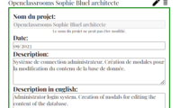
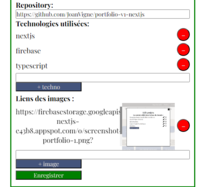

# Portfolio Web

Bienvenue sur mon portfolio web, un projet réalisé dans le cadre de ma formation d'intégrateur web sur OpenClassrooms.

## lien 

## Technologies utilisées

- [Next.js](https://nextjs.org/)
- [TypeScript](https://www.typescriptlang.org/)
- [Firebase](https://firebase.google.com/)

## Fonctionnalités

- **Page d'accueil** : Mes projets personnels, mes projets de formations, mon parcours d'apprentissage, et un formulaire de contact.

- **Page Admin** : Permet de modifier les données du site. (Ajout, modification, suppression)

## Visuel

## Visiter le site ! 

lien